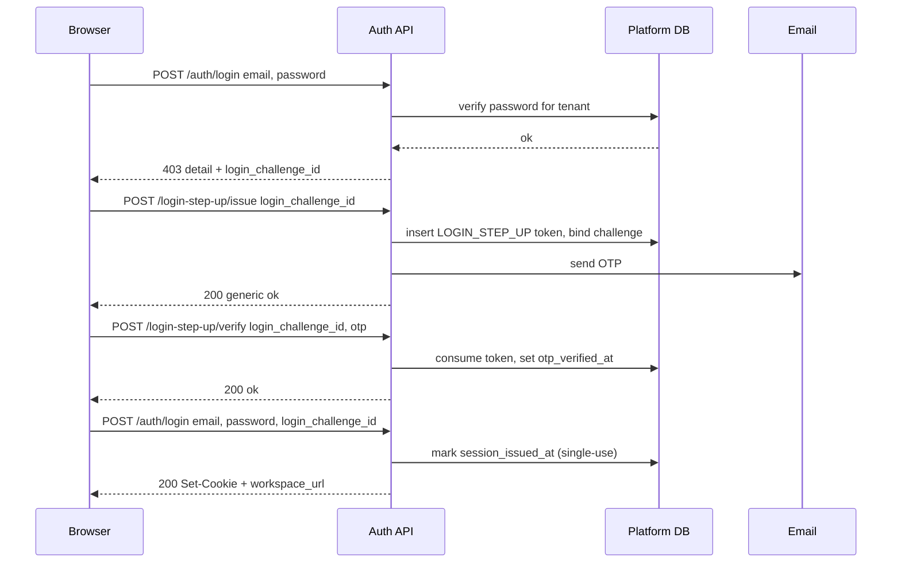

# Tenant manual: how sign-in works

This document describes end-to-end **workspace login** as implemented in TruckERP: what the browser does, what the API enforces, and how optional **human verification (Turnstile)** and **email step-up (OTP)** layers interact. It is written for operators and technically literate tenant admins; it mirrors current code paths (not an aspirational design).

---

## 1. Two ways to reach the sign-in screen

**Workspace URL (recommended)**  
Host looks like `your-company.example.com` (a subdomain of the platform base domain). The edge middleware resolves **tenant** from this host. All tenant-scoped API calls, including login, are tied to that workspace.

**Marketing / apex URL**  
Host is the bare base domain (no workspace subdomain). For `POST /api/v1/auth/login` only, the API is allowed through without a pre-resolved tenant; the handler **derives** `tenant_id` from the user’s email, memberships, and password checks (`_resolve_tenant_id_for_apex_login`).  

**Important:** Email step-up (`/auth/login-step-up/issue` and `/auth/login-step-up/verify`) **cannot** be completed from the apex host. Middleware returns **403** with `detail: "Use your company sign-in URL to continue."` unless the request has a workspace subdomain (or equivalent tenant context). The `login_challenge_id` from that 403 is bound to a specific **`tenant_id`** in the platform database. Completing issue and verify therefore **must** happen on the **workspace hostname for that same tenant and workspace context** (the host that resolves to the same `tenant_id` as the challenge). If the user started sign-in on apex and received a step-up challenge, they must continue on that workspace URL—not an arbitrary “company” URL for a different tenant—or the challenge will not match and the flow will fail.

---

## 2. API endpoints involved in sign-in

| Method | Path | Role |
|--------|------|------|
| POST | `/api/v1/auth/login` | Primary sign-in: validates identity and password for the resolved tenant, optional Turnstile, optional step-up gate, then issues session cookies (and tokens in JSON). |
| POST | `/api/v1/auth/login-step-up/issue` | After step-up is required: sends a one-time code by email for an existing `login_challenge_id` (workspace host only). |
| POST | `/api/v1/auth/login-step-up/verify` | Validates the OTP for that challenge (workspace host only). |
| POST | `/api/v1/auth/logout` | Clears session cookies. |

Forgot-password and reset-password are separate flows and are **not** described in depth here.

---

## 3. Order of operations for `POST /api/v1/auth/login`

Below is the **logical** order after the request reaches the auth router. Minor branches exist for **tenant DB auth** vs **platform-stored password**; both converge on the same step-up gate before cookies.

### 3.1 Request edge (before the route handler)

- **Rate limits:**  
  - Per client IP: **15 attempts per 15 minutes** (`login_per_ip`).  
  - Per **tenant + normalized email** (hashed): **5 attempts per hour** (`login_per_tenant_email`).  
  Exceeded → **429** with login-specific throttle messaging (`LOGIN_RATE_LIMIT_*_DETAIL` in `app/utils/rate_limit.py`).

- **Tenant resolution:**  
  - If `request.state.tenant_id` is already set (workspace host), that tenant is used.  
  - If not (apex login), `_resolve_tenant_id_for_apex_login` runs (see §5). Result is stored on `request.state` for downstream code.

### 3.2 Tenant readiness

- Tenant must exist, `status == ACTIVE`, `db_status == READY`.  
  Otherwise **404** (not found) or **403** (not ready).

### 3.3 Identity and password (workspace-scoped)

Email is **normalized** once (`normalize_auth_email`) and reused for all checks.

**Tenant DB auth mode** (`tenant_uses_tenant_db_auth`):

1. Load `TenantUser` for `(tenant_id, email_norm)`. Missing / wrong mapping → **401** `"Invalid email or password"` (anti-enumeration).
2. User must be **ACTIVE**; inactive → **403** (explicit deactivation message).
3. Must have **active** `TenantWorkspaceMember`; else **401** generic.
4. If no `password_hash` on tenant user → **401** with message to use **Forgot password** (explicit; distinct from generic failure).
5. **Turnstile gate** (§4): `assert_login_human_verification_if_armed` — may raise **403** with `detail: "Additional verification required."` **without** `login_challenge_id`.
6. Verify password. On failure → record password fail streak (§4.3), audit log, **401** generic.
7. Platform user mapping (`PlatformTenantUserMap`), platform user active, `TenantMembership` active — otherwise **503** / **403** as coded.
8. **Step-up gate** (§6): `login_step_up_challenge_gate_after_password`. May return **403** JSON with `detail` + **`login_challenge_id`**, or raise **401** if finalizing with a bad/consumed challenge.

**Platform auth mode** (password on `PlatformUser` for this workspace):

1. Load platform user by email; missing membership → **401** generic where applicable.
2. Deactivated / suspended membership → **403** as coded.
3. No `password_hash` → **401** forgot-password hint.
4. Turnstile gate (same as above).
5. Verify password; failures streak + **401** generic.
6. Same step-up gate as tenant-db path.

### 3.4 After success (no step-up block, or challenge consumed)

- **Clear** password fail streak for `(tenant_id, email_norm)` (`clear_login_password_fail_streak`).
- Issue **access** and **refresh** JWTs; set **httpOnly cookies** (and return tokens in JSON for clients that need them).
- Return `ok`, optional **`workspace_url`** for redirect to dashboard on that host.

---

## 4. Human verification (Cloudflare Turnstile)

### 4.1 When it runs

Turnstile is checked **before** `verify_password` **only if**:

- `turnstile_secret_key` is configured **and**
- **`login_password_turnstile_armed`** is true for this **tenant + email** (§4.3): failed-password count **≥ `LOGIN_PASSWORD_TURNSTILE_THRESHOLD` (3)** in the rolling window.

If armed and the submitted token does not verify → **403** with:

```json
{ "detail": "Additional verification required." }
```

There is **no** `login_challenge_id` in this response. The client should render the Turnstile widget and retry `POST /auth/login` with `turnstile_token` (aliases supported: `cf_turnstile_response`, `cf-turnstile-response`).

### 4.2 Disambiguating 403 `"Additional verification required."`

The same **detail string** is reused for two different cases:

| Condition | HTTP | Body fields | Meaning |
|-----------|------|-------------|---------|
| Turnstile required / failed | 403 | `detail` only | Complete Turnstile, retry login with token. |
| Email OTP step-up required | 403 | `detail` **and** `login_challenge_id` (UUID) | Run step-up issue → verify → login again with `login_challenge_id`. |

Clients **must** branch on the presence of **`login_challenge_id`**.

### 4.3 Password failure streak (arms Turnstile and step-up OTP)

- Stored in the **platform** DB: `platform_login_password_fail_streaks` (per `tenant_id` + email **fingerprint**, not raw email in logs). Logic in `app/services/login_password_abuse.py`.
- Each **failed password verification** (after `verify_password` runs) increments the streak within a **1-hour window** (`LOGIN_PASSWORD_FAIL_WINDOW_SECONDS = 3600`).
- **`login_password_turnstile_armed`:** streak **≥ `LOGIN_PASSWORD_TURNSTILE_THRESHOLD` (3)** → next attempts require **Turnstile** before password (if Turnstile is configured).
- **`login_password_otp_step_up_armed`:** streak **≥ `LOGIN_PASSWORD_OTP_STEP_UP_THRESHOLD` (5)** → after a **correct** password, **`login_step_up_otp_required_for_this_attempt`** is true and OTP step-up runs before session (see §6). No forced password reset from counts alone.
- A user may therefore hit **Turnstile** (from 3 failures) **and later** **OTP step-up** (from 5 failures) in the same window.

**Clearing the streak:** On a **fully successful** login (cookies issued), the streak row is cleared for that `(tenant_id, email_norm)`.

**Trusted browser (v1, UX only):** After successful login, the API may set an httpOnly signed cookie `trk_login_trust` (`app/utils/login_trust_cookie.py`) with **~90-day** TTL, refreshed on each successful login. Signing uses **`LOGIN_TRUST_COOKIE_SECRET`** (not the JWT secret) in production/staging. Logout clears it. The login JSON may include **`familiar_device`** (true if a valid cookie for this tenant was present **before** this login). This does **not** skip password or OTP when policy requires them.

---

## 5. Apex login: how `tenant_id` is chosen

On the **apex** host, middleware does not set `tenant_id` for login; the handler calls `_resolve_tenant_id_for_apex_login`:

1. Resolve `PlatformUser` by normalized email. Missing → **401** generic.
2. Enumerate active `TenantMembership` rows joined to **ACTIVE**, **READY** tenants.
3. **Tenant-db auth tenants** are tried in order: for each, verify workspace member, password, platform map, etc. First matching tenant where password succeeds and map matches platform user → that **`tenant_id`** is returned.
4. If no tenant-db match, collect tenants using **platform** password mode.  
   - **Zero** such tenants → **401** generic (after audit in some branches).  
   - **More than one** platform-auth tenant for this user → **409** asking the user to sign in via a specific workspace URL (cannot disambiguate on apex).
5. **Single** platform-auth tenant → return its `tenant_id`.

Apex resolution performs **Turnstile** and **password checks** while iterating; failures record streaks against the tenant under test.

---

## 6. Email step-up (challenge-bound OTP)

Login step-up is a **distinct behavioral flow** from signup email verification: different HTTP routes, rate limiters, database lookups (`purpose`, `tenant_id`, `login_challenge_id` predicates), challenge/session semantics, and success paths. It does **not** call signup verify or provision handlers. At the same time, it **reuses the shared OTP infrastructure**—the same hashing/check helpers (`app.utils.otp`), the same `platform_otp_tokens` table with a row `purpose`, and the same mail delivery helper (`send_otp_email_for_purpose`)—so this is **not** a second, parallel OTP stack.

Data used for login step-up:

- **`platform_login_otp_challenges`** — short-lived row per step-up attempt: `tenant_id`, `email_norm`, `expires_at`, `password_verified_at`, `otp_verified_at`, `session_issued_at`.
- **`platform_otp_tokens`** — stores hashed OTP with `purpose = LOGIN_STEP_UP`, **`tenant_id`**, and **`login_challenge_id`** (FK to challenge). Signup email-verify rows use a different `purpose` and keep `login_challenge_id` null.

### 6.1 When step-up is required **after** password succeeds

**Server decision** (`login_step_up_otp_required_for_this_attempt`):

- **`True`** if either:
  - settings flag **`login_step_up_otp_required`** is on (emergency / test hook), **or**
  - **`login_password_otp_step_up_armed`** is true (≥**5** failed password attempts in the rolling window; `app/services/login_password_abuse.py`).

If **not** required, login proceeds straight to cookies (subject to other checks).

### 6.2 First login response when step-up is required (no `login_challenge_id` on request)

After password verification succeeds, **`login_step_up_challenge_gate_after_password`** runs:

- If the client did **not** send `login_challenge_id`:
  - If step-up required → **create or reuse** an open challenge (`get_or_create_open_login_otp_challenge_after_password`), then respond **403** with **only**:

    ```json
    {
      "detail": "Additional verification required.",
      "login_challenge_id": "<uuid>"
    }
    ```

  - Challenge TTL: **15 minutes** from creation (`CHALLENGE_TTL_MINUTES`).
  - Reuse rule: existing row for same `tenant_id` + `email_norm` with `otp_verified_at` and `session_issued_at` null and not expired → return same id.

- If step-up **not** required → return `None` (handler continues to issue session).

**No cookies** are issued on this 403.

### 6.3 Issuing the OTP — `POST /api/v1/auth/login-step-up/issue`

Body:

```json
{ "login_challenge_id": "<uuid>" }
```

Requirements:

- **Workspace host** (tenant resolved on request). Apex without tenant → **403** `"Use your company sign-in URL to continue."`
- `request.state.tenant_id` must match challenge `tenant_id`.
- Challenge must exist, not expired, `session_issued_at` null.
- If challenge already has `otp_verified_at` set → handler treats as no-op for sending (idempotent / safe).
- **Rate limits:**  
  - Issue: **10 / 15 min** per IP, **5 / hour** per tenant+email fingerprint.

Response (anti-enumeration): always **200** with a **generic** success shape from the router, e.g. confirmation that if an account applies, a code may arrive — even when the challenge id is unknown to an attacker (**no** distinction in HTTP status).

Implementation superseded previous unconsumed LOGIN_STEP_UP tokens for that challenge and inserts a new `PlatformOTPToken`, then sends email via `send_otp_email_for_purpose` with purpose **LOGIN_STEP_UP**.

### 6.4 Verifying the OTP — `POST /api/v1/auth/login-step-up/verify`

Body:

```json
{ "login_challenge_id": "<uuid>", "otp": "<code>" }
```

- Same workspace host and tenant binding as issue.
- Loads latest active OTP row for that purpose, **`tenant_id`**, and **`login_challenge_id`**; checks code; on success sets `consumed_at` on the token and **`otp_verified_at`** on the challenge.
- **Rate limits:** **15 / 15 min** per IP, **20 / 15 min** per tenant+email on verify.
- Failure → **401** with generic invalid credential style message (no enumeration).

### 6.5 Final login — `POST /api/v1/auth/login` with `login_challenge_id`

Client sends the **same** `email`, **password**, and **`login_challenge_id`**, plus **`turnstile_token`** again if the Turnstile gate is still armed for that identity.

Gate logic when `login_challenge_id` is present:

1. **`validate_challenge_ready_for_session`**: row exists; `tenant_id` and `email_norm` match current login context; not expired; **`otp_verified_at` set**; **`session_issued_at` null**.
2. **`mark_challenge_session_issued`**: single SQL `UPDATE ... WHERE session_issued_at IS NULL ... RETURNING id`.  
   - **Only one winner**: if two requests race, at most one row is updated; the other gets **401** generic — **no** second session from the same challenge.

Then the handler continues and issues cookies as usual.

### 6.6 Data retained for audit / security

Event logs use **email_fingerprint** where appropriate. OTPs are stored **hashed** in `platform_otp_tokens`. Login step-up **does** reuse the shared OTP helpers and email-sending path used elsewhere (e.g. signup), but it **does not** reuse signup routes, signup rate limits, signup verify/provision endpoints, signup lookup predicates, or signup completion logic—those remain isolated.

---

## 7. Typical user-visible flows

### 7.1 Normal login (no streak, no force flag)

Email + password → **200** → redirect to dashboard / `workspace_url`.

### 7.2 Login with Turnstile only

After repeated wrong passwords, next attempt → **403** without `login_challenge_id` → user completes Turnstile → retry with token → password check → **200** (if step-up not also required).

### 7.3 Login with OTP step-up

Successful password → **403** with `login_challenge_id` → (workspace host) **issue** → email code → **verify** → **login** again with `login_challenge_id` → **200**.

If Turnstile was required on the **first** password attempt, the **final** login should still pass **`turnstile_token`** while the streak is armed (web client stores token for that sub-flow).

### 7.4 Combined Turnstile + OTP

Possible when streak is armed **and** step-up is required after correct password: Turnstile before password, then OTP after password, then final login with both challenge id and Turnstile if still armed.

---

## 8. Web app behavior (reference)

The SPA on **`/login`**:

- Calls `POST /api/v1/auth/login` with JSON `email`, `password`, optional `turnstile_token`.
- On **403** + `detail` + **`login_challenge_id`**: calls **issue**, shows OTP field, **verify**, then **login** with `login_challenge_id`.
- On **403** + `detail` **only**: shows Turnstile and retries login with token.
- Changing email or password resets the step-up state on the client.

---

## 9. Operator notes

- Ensure **platform** migrations include `platform_login_otp_challenges` and `platform_otp_tokens.login_challenge_id` before enabling this in an environment.
- **`login_step_up_otp_required`** forces OTP for every successful login (for testing); normal production behavior uses streak + optional flag.
- Teach end users: if step-up fails with a workspace-host error after apex login, they must continue on the **workspace URL for the same tenant** the challenge belongs to (not a different workspace).
- **429** responses on login / step-up indicate rate limiting — wait and retry, investigate abuse if persistent.

---

## 10. Sequence diagram (happy path with OTP)



---

## 11. Production sign-in abuse policy

Policy below matches **implemented** thresholds and limits in `login_password_abuse.py`, `login_step_up_otp.py`, and `rate_limit.py`. **Forced password reset** is not triggered from failed-attempt counts; use separate security/admin processes for high-confidence compromise.

- **Rolling window:** 1 hour per `tenant_id` + normalized email (`platform_login_password_fail_streaks`).
- **≥ 3** failed password checks: **Turnstile** before password (when configured).
- **≥ 5** failed password checks: **correct password** still requires **email OTP step-up** before session.
- **Per-tenant+email login:** **5/hour**; **per-IP login:** **15 / 15 min**; **forgot-password** respects full tenant+email login bucket on workspace host.
- **Trusted browser v1:** httpOnly cookie `trk_login_trust` (~90-day TTL, refreshed on successful login, cleared on logout), HMAC key from **`LOGIN_TRUST_COOKIE_SECRET`** (prod/staging); **`familiar_device`** in login response for UX only—**does not** bypass password or OTP.
- **Edge/firewall:** chronic abusive IPs handled outside the app.

---

*This manual reflects the login step-up challenge design (`platform_login_otp_challenges` plus `platform_otp_tokens` with `LOGIN_STEP_UP`, sharing OTP and mail infrastructure with other flows). For password reset and signup verification behavior and routes, see other docs.*
